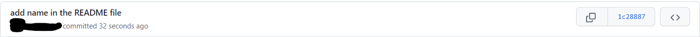
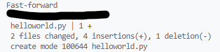
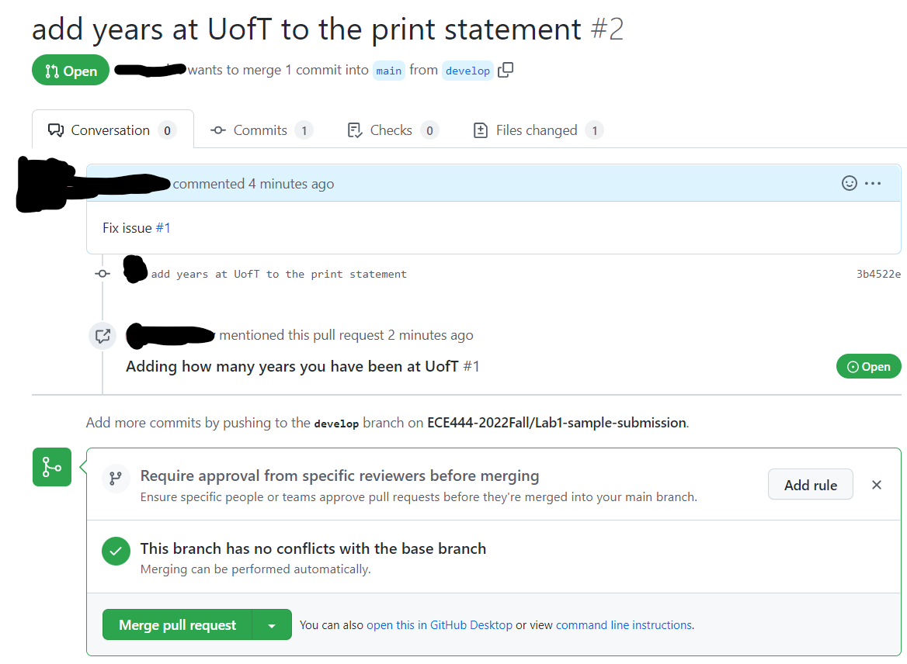
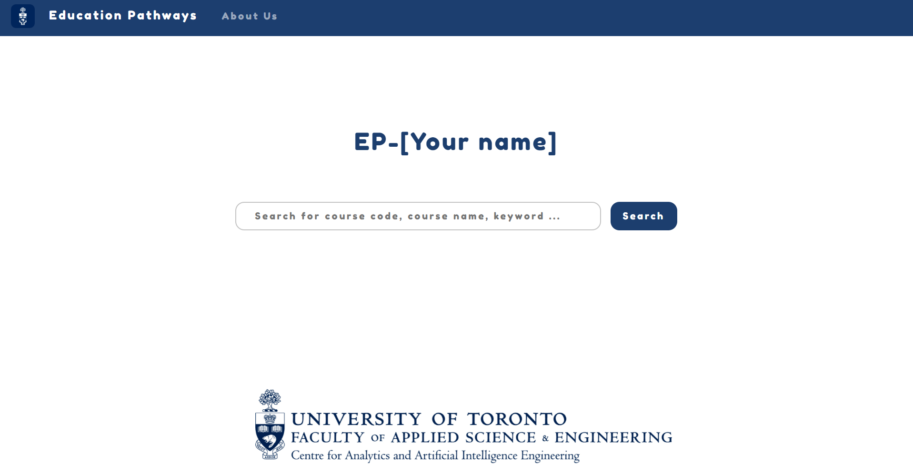
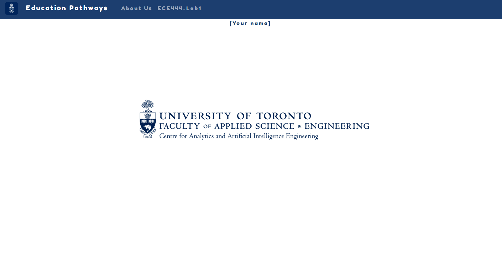

# Lab1-sample-submission
An example of what the readme file of your lab1 submission should look like.

This is just an example to demonstrate how your submission will look like, NOT all activities are implemented here in this repo.

To protect your privacy, please feel free to remove sensitive personal information from your screenshots.

## What your submission should look like:

[Your Name]

**Activity 1**

**Activity 2**

**Activity 3**

**Activity 4**

[Link to your teammate's repo]

[Screenshot of the commit you made to your teammate's repo]

[Screenshot of the commit your teammate made to your repo]

**Activity 5**

[Screenshots of the commands that you used to rebase  along with their outpus]

**Activity 6**

[Link to your ECE444-F2022-Lab1-EP repo]

**Activity 7**

[Screenshot of your rebase command]

**Activity 8**

[Screenshot of your rebase command]

## Tips

[Markdown cheatsheet](https://github.com/adam-p/markdown-here/wiki/Markdown-Cheatsheet)

To inser images in markdown files on GitHub: just include the images in the repo, and then refer to them with either relative path or absolute path
